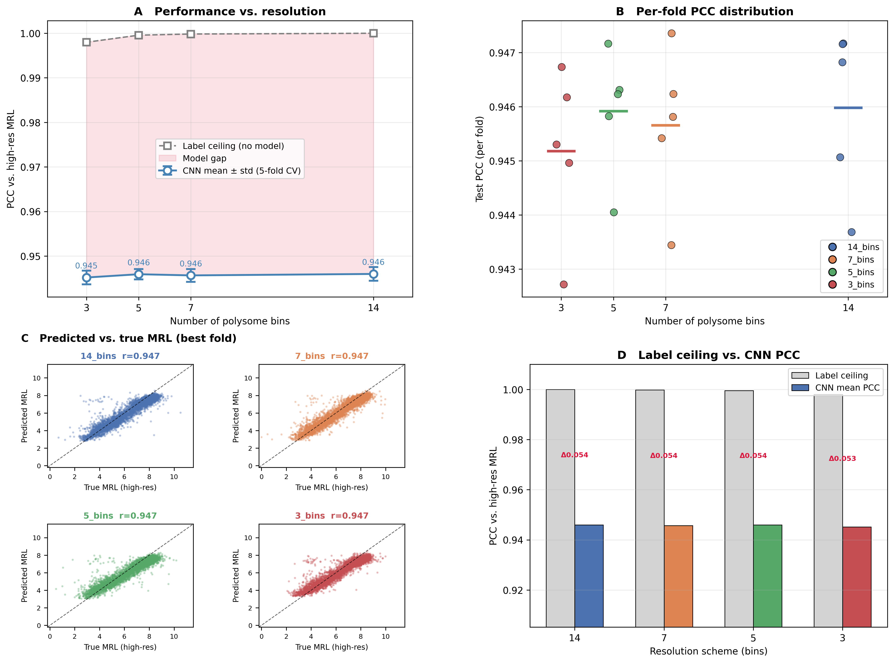
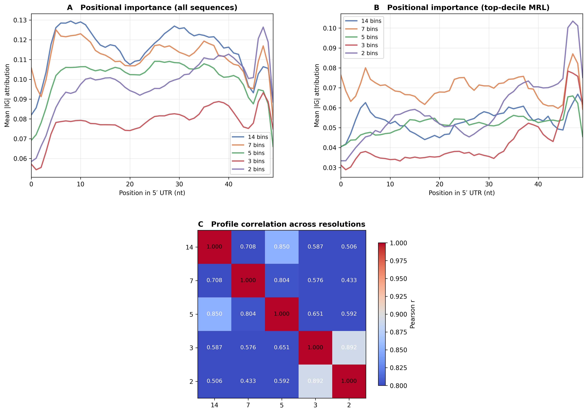

<div align="center">

# Polysome Resolution Project

## **Investigating Effects of Polysome Profiling Resolution for a Translation Reporter Assay with Deep Learning**

### Systems Biology: Computational Analysis and Interpretation of High-throughput Data  

### Final Project (2025/2026)  

### Humboldt-Universität zu Berlin

</div>

---

## Overview

This project investigates how reducing the resolution of polysome profiling affects the ability of a convolutional neural network (CNN) to predict mean ribosome load (MRL) from 5′ UTR sequences.

Polysome profiling separates mRNAs by ribosome occupancy via sucrose density gradient centrifugation. The original dataset uses 14 fractions. We simulate lower-resolution experiments by merging adjacent fractions into coarser schemes (7, 5, 3, and 2 bins) and ask: **can polysome profiling experiments be simplified by using fewer fractions without losing predictive power?**

**Reference:** Sample, P.J. et al. Human 5′ UTR design and variant effect prediction from a massively parallel translation assay. *Nature Biotechnology* 37, 803–809 (2019).  

DOI: [10.1038/s41587-019-0164-5](https://doi.org/10.1038/s41587-019-0164-5)

Dataset: [GSM3130435](https://www.ncbi.nlm.nih.gov/geo/query/acc.cgi?acc=GSM3130435)

---

## Key Findings

- **Resolution barely affects prediction performance down to 3 bins.** CNNs trained on 7, 5, or 3-bin labels all reach test PCC ~0.945, within 0.001 of the 14-bin baseline (ΔPCC < 0.08%).
- **Performance drops at 2 bins.** The 2-bin model reaches PCC = 0.931, a drop of 0.015 (1.61%). This is consistent with the lower label ceiling at 2 bins (PCC = 0.981 vs ~1.000 for 3+ bins). The labels themselves lose information at this resolution.
- **The label ceiling is near 1.0 for all schemes down to 3 bins.** MRL rankings are almost perfectly preserved even after merging down to 3 bins (PCC = 0.998, MAE = 0.136). At 2 bins the ceiling drops to 0.981 and MAE rises to 0.340.
- **Resolution changes what the model learns.** Attribution profiles diverge at low resolution. Cross-resolution profile correlation between 14-bin and 3-bin models is only r = 0.587, and drops further to r = 0.506 for 14 vs 2 bins. The 3 and 2-bin models are more similar to each other (r = 0.892) than to any higher-resolution model.
- **Biological signal is consistent across resolutions.** Attribution logos show a similar broad pattern: G suppresses translation, A and T promote it, and the region near the start codon (positions ~45–49) carries the strongest positional signal across all schemes.

---

## Key Results

Reducing polysome profiling resolution has little impact on predictive performance down to 3 bins. A CNN trained on 3-bin labels achieves nearly the same accuracy as one trained on the full 14-bin experiment. The 2-bin scheme shows a clear drop.

<p align="center">
  
</p>

While prediction performance stays stable from 14 to 3 bins, the learned biological signals shift. High-resolution models capture fine positional motifs; low-resolution models rely more on global composition. The 2-bin model's attribution profile is most similar to the 3-bin model and least similar to the 14-bin model.

<p align="center">
  
</p>

---

## Repository Structure
```
polysome-resolution-project/
├── code/
│   ├── polysome_resolution_project.ipynb   # Main notebook (Google Colab, exported)
│   └── polysome_resolution_project.py      # Exported Python script
├── results/
│   ├── arch_search_results.png             # Architecture search: val PCC per hyperparameter
│   ├── attribution_comparison.png          # IG positional profiles + cross-resolution correlation
│   ├── attribution_logo_all_schemes.png    # Sequence logos per resolution scheme
│   ├── evaluation_pcc_vs_resolution.png    # Main result: PCC vs resolution + label ceiling
│   ├── loss_curve.png                      # Training loss curve (final retrain)
│   ├── mrl_distribution.png                # MRL distribution (14-bin, n=280,000)
│   ├── mrl_distributions_per_scheme.png    # MRL distributions across resolution schemes
│   └── per_nucleotide_importance_all_schemes.png  # Signed IG attributions per nucleotide
└── README.md
```

---

## Methods Summary

### Data
- 280,000 synthetic 50-nt 5′ UTR sequences (top by read depth) from Sample et al. (2019)
- MRL computed via two-step normalization following Supplementary Note 1 of the original paper
- Resolution schemes: 14 bins (full), 7 bins (paired merge), 5 bins, 3 bins (coarse), 2 bins (extreme coarsening)

### Model
- 1D CNN: 3 × (Conv1d + ReLU) → Flatten → FC head → scalar MRL output
- Best architecture from search over 15 configs: kernel_size=13, n_filters=64, n_fc_layers=2, fc_width=40, dropout=0.1
- Fixed architecture used across all resolution experiments to avoid confounding
- Trained on low-resolution MRL labels; evaluated against high-resolution 14-bin MRL on held-out test set
- 5-fold cross-validation on 224,000 sequences; 56,000 held-out test sequences

### Evaluation
- **Label ceiling:** PCC(low-res MRL, high-res MRL) on test set. Upper bound imposed by bin merging, independent of any model
- **Model gap:** ceiling minus CNN PCC; indicates whether the bottleneck is resolution or model capacity
- **Attribution analysis:** Integrated Gradients (Captum) on best-fold models; positional importance profiles compared across resolutions via pairwise Pearson correlation

### Results summary

| Scheme | Bins | Label ceiling | CNN PCC | ±std | Gap |
|--------|------|--------------|---------|------|-----|
| 14_bins | 14 | 1.0000 | 0.9460 | 0.0016 | 0.054 |
| 7_bins | 7 | 0.9998 | 0.9457 | 0.0014 | 0.054 |
| 5_bins | 5 | 0.9996 | 0.9459 | 0.0012 | 0.054 |
| 3_bins | 3 | 0.9980 | 0.9452 | 0.0015 | 0.053 |
| 2_bins | 2 | 0.9808 | 0.9307 | 0.0020 | 0.050 |

---

## Requirements

The notebook runs on **Google Colab** (GPU recommended; ~60 min on NVIDIA A100).
```
torch
numpy
pandas
scipy
scikit-learn
matplotlib
captum
logomaker
```

The raw data CSV (`GSM3130435_egfp_unmod_1.csv`) must be downloaded from [GEO](https://www.ncbi.nlm.nih.gov/geo/query/acc.cgi?acc=GSM3130435) and placed in the project data directory.